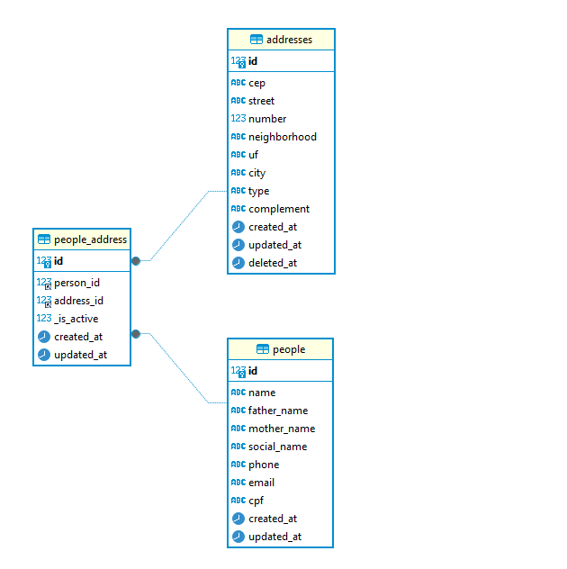

# Desafio Prodemge

### 📝Sobre:
Este projeto foi desenvolvido com o intuito de pleitear uma vaga na área de desenvolvimento da Prodemge e tinha como proposta um periodo de 12 horas para desenvolver uma listagem e cadastro de pessoas alem da atualização de endereço comercial e residencial destes.

### 💻 Tecnologias Utilizadas:
Conforme solicitado pelo propoente foram ultilizadas as mais recentes versões estaveis dos frameworks Vue.js, Vuetify e Laravel, porem, tambem ultilizei outros frameworks como vuelidate para a validação e inertia para o desenvolvimento em vue dentro das blades do laravel.

### 📝DER do Banco de Dados:

### ❌ Dificuldades Encontradas:
Por está a muito tempo sem tocar em frontend perdi muito tempo montando telas e com problemas simples no vue e em sua conexão com o laravel o que me impediu de terminar o desafio no tempo disponibilizado. Após a seleção planejo retornar a este codigo para finalizar-lo.
* **Não foi feito o frontend de cadastro de endereço**
* **Planejava fazer um sistema de login simples que tambem não foi concluido**
* **As telas estão cruas e funcionam mais como rascunho** 
* **A validação do back não está sendo retornada corretamente para o front** 
* **Por mais que a paginação tenha sido concluida na API esta não foi implementada no front** 
